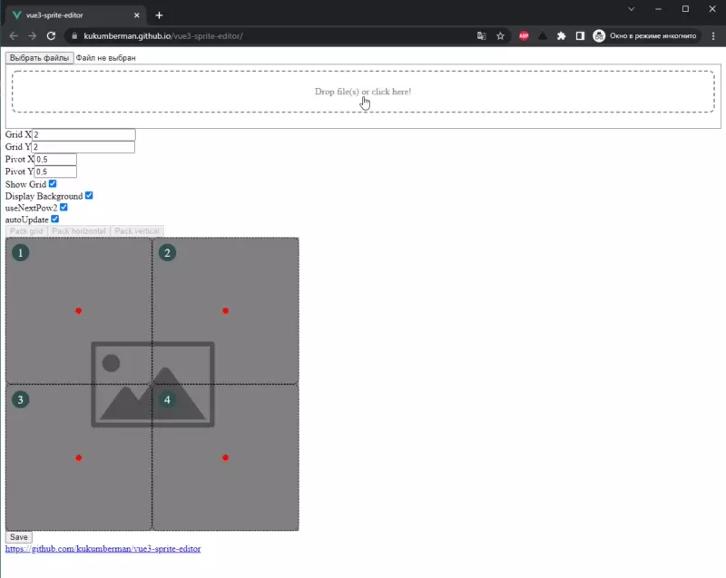

# vue3-sprite-editor

## Description

Currently there is one tool in the editor collection:
- **Spritesheet Creator**

### Spritesheet Creator

Used to package multiple sprites into single atlas defined by parameters

- Upload/drag & drop multiple files
- Grid alignment
- Horizonal and vertical alignment
- Pivot alignment (in case if images has different dimensions)
- Minor params:
  - display grid — just visual outline
  - display backgroud — gray color determines transparency
  - `useNextPow2` — if checked — resizes image dimensions to next power of 2 (e.g., `200 -> 256`, `1000 -> 1024`) and then generates sprite
  - `autoUpdate` — if checked — re-creates sprite when one of the parameters changes (kinda hot reload, but might be slow when processing images with large dimensions)

## Todo
- [ ] Design a website

## Try it yourself

https://kukumberman.github.io/vue3-sprite-editor/

## Showcase

<table>
  <tr>
    <td>
      
    </td>
  </tr>
</table>
